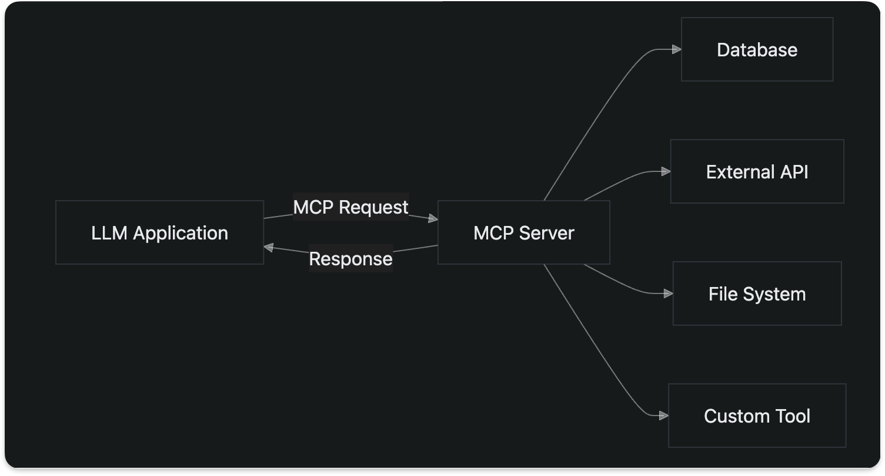

# Model Context Protocol Implementations

## Introduction

The Model Context Protocol (MCP) is a standardized framework designed to enhance AI model interoperability and context management by enabling seamless communication between large language models (LLMs) and external data sources, tools, and services. MCP facilitates structured data exchange, allowing AI applications to dynamically access and utilize real-time information, databases, APIs, and computational tools while maintaining contextual coherence. This protocol is particularly valuable in agent-based systems, retrieval-augmented generation (RAG), and multi-step reasoning workflows where context preservation and external tool integration are critical.

In the Go ecosystem, several implementations of MCP have emerged to support high-performance, concurrent, and scalable AI applications. This document provides a comprehensive overview of the key Go-based MCP implementations listed in the awesome-golang-ai repository: mcp-go, mcp-golang, and gateway. Each implementation offers distinct architectural approaches, integration capabilities, and use cases, catering to different project requirements in terms of simplicity, flexibility, and performance.

## Core Components

The core components related to Model Context Protocol in this repository are three distinct Go implementations that enable LLMs to interact with external systems:

- **[mcp-go](https://github.com/mark3labs/mcp-go)**: A full-featured Go implementation of MCP that enables seamless integration between LLM applications and external data sources and tools.
- **[mcp-golang](https://github.com/metoro-io/mcp-golang)**: A lightweight library that allows developers to write MCP servers in just a few lines of Go code, emphasizing developer productivity and rapid prototyping.
- **[gateway](https://github.com/centralmind/gateway)**: A universal MCP server specifically optimized for databases and AI agents, acting as a middleware layer between LLMs and data backends.

These components are not part of the local repository but are external projects referenced for their relevance to Go-based AI development using MCP.

## Architecture Overview

The architecture of MCP implementations in Go follows a client-server model where LLM applications act as clients that send context-aware requests to MCP servers, which in turn interface with external tools, databases, or APIs. The protocol standardizes the format of these interactions, ensuring consistent data exchange and error handling.

## Detailed Component Analysis

### [mcp-go](https://github.com/mark3labs/mcp-go) Analysis

**mcp-go** is a comprehensive Go implementation of the Model Context Protocol, designed to facilitate seamless integration between LLM applications and external resources. It provides a robust foundation for building context-aware AI systems that can dynamically access tools and data.

**Key Features**:

- Full MCP specification compliance
- Support for bidirectional context exchange
- Extensible plugin architecture for custom tools
- Built-in serialization and deserialization of context objects
- Error handling and validation mechanisms

This implementation is ideal for applications requiring deep integration with multiple external systems while maintaining strict context management.

### [mcp-golang](https://github.com/metoro-io/mcp-golang) Analysis

**mcp-golang** is designed for simplicity and rapid development, allowing developers to create MCP servers with minimal code. Its primary value proposition is ease of use and fast prototyping.

**Key Features**:

- Minimal boilerplate code required
- High-level abstractions for common MCP patterns
- Easy routing and handler registration
- Lightweight dependency footprint
- Straightforward configuration options

This implementation suits projects where development speed and simplicity are prioritized over advanced customization.

### [gateway](https://github.com/centralmind/gateway) Analysis

**gateway** functions as a universal MCP server optimized for database interactions and AI agent workflows. It acts as a middleware layer that translates MCP requests into database queries and returns structured results.

**Key Features:**

- Database-native optimization
- Query planning and execution
- Connection pooling and performance tuning
- Schema introspection and auto-discovery
- Security and access control layers

This implementation is best suited for AI applications that rely heavily on real-time data retrieval from structured databases.

## Performance Considerations

When selecting an MCP implementation in Go, performance considerations should align with the application's operational requirements:

- **mcp-go** offers balanced performance with extensibility, suitable for production-grade applications requiring reliable context management and tool integration.
- **mcp-golang** prioritizes development speed and may have slightly higher overhead due to abstraction layers, making it ideal for prototyping and small-scale deployments.
- **gateway** is optimized for database-intensive workloads, providing efficient query execution and connection management for data-heavy AI applications.

All implementations benefit from Go's inherent advantages: low memory footprint, high concurrency support via goroutines, and fast execution speed, making them well-suited for real-time AI systems.

## Troubleshooting Guide

While specific error handling mechanisms cannot be detailed without access to the source code of the referenced implementations, general troubleshooting principles for MCP systems in Go include:

- Validate MCP message formats using schema checks
- Implement structured logging for request/response tracing
- Use Go's built-in panic recovery in server implementations
- Monitor connection states with external resources
- Test context serialization/deserialization thoroughly

Developers should consult the respective GitHub repositories for detailed error codes, debugging tools, and community support channels.

## Conclusion

The Model Context Protocol represents a significant advancement in AI interoperability, enabling LLMs to maintain context while interacting with external systems. In the Go ecosystem, mcp-go, mcp-golang, and gateway provide diverse options for implementing MCP, each catering to different development priorities:

Choose mcp-go for full-featured, production-ready integrations
Use mcp-golang for rapid prototyping and simple server implementations
Select gateway for database-centric AI applications requiring optimized data access
These implementations leverage Go's strengths in concurrency, performance, and reliability, making them excellent choices for building scalable, context-aware AI systems. As the MCP standard evolves, these Go libraries are likely to play a crucial role in advancing the capabilities of AI agents and LLM applications.
