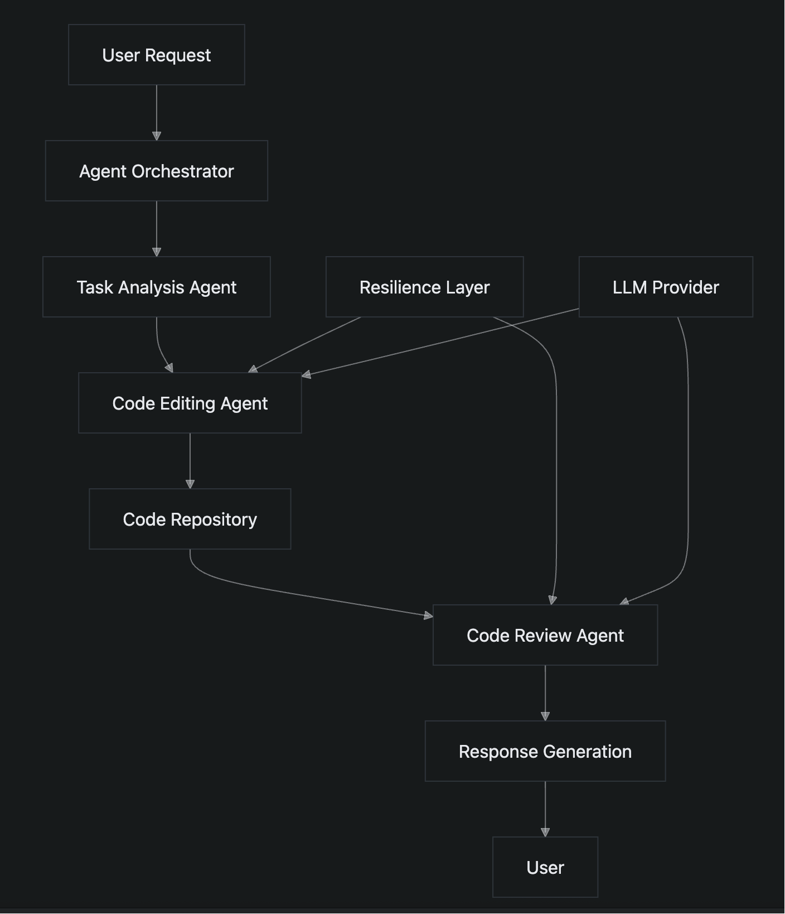
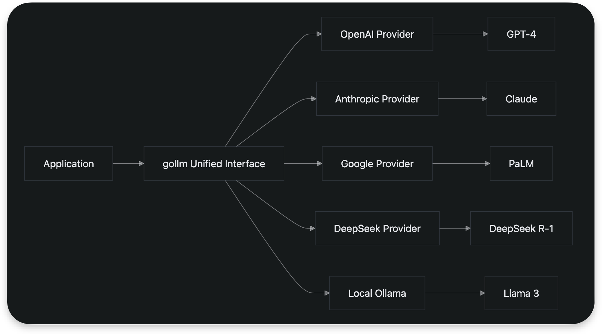

# Large Language Model Tools

## Introduction

The Go ecosystem offers a rich collection of tools for developing and deploying applications powered by Large Language Models (LLMs). These tools span various categories including GPT integrations, ChatGPT applications, agent frameworks, SDKs for LLM providers, and development tools. This document provides a comprehensive overview of notable tools in each category, their functionality, and practical usage patterns in Go. The analysis is based on the `awesome-golang-ai` repository, which curates high-quality AI-related tools and libraries for the Go programming language.

## GPT Integrations

GPT integrations in the Go ecosystem enable developers to leverage pre-trained language models for various natural language processing tasks. One notable implementation is `gpt-go`, a minimal GPT model implemented from scratch in pure Go and trained on Jules Verne books. This project demonstrates how to build and train transformer-based models directly in Go, providing educational value for understanding the internals of language models.

While `gpt-go` serves as a learning tool, it highlights Go's capability to handle machine learning workloads despite not being traditionally associated with deep learning. The implementation showcases Go's strengths in concurrency and memory management when processing sequential data.

## ChatGPT Apps

ChatGPT applications in Go demonstrate practical use cases of LLM integration in real-world scenarios. Two prominent examples include [feishu-openai](https://github.com/ConnectAI-E/feishu-openai) and [chatgpt-telegram](https://github.com/m1guelpf/chatgpt-telegram).

The [feishu-openai](https://github.com/ConnectAI-E/feishu-openai) integration connects Feishu (Lark) with multiple AI services including GPT-4, GPT-4V, DALL·E-3, and Whisper, creating an enhanced work experience. This application showcases how Go can serve as a backend for enterprise communication platforms, handling complex integrations with various AI services.

The [chatgpt-telegram](https://github.com/m1guelpf/chatgpt-telegram) bot enables users to run their own ChatGPT-powered Telegram bot with a single command. This demonstrates Go's suitability for building lightweight, production-ready chat applications that can interface with LLM APIs. The simplicity of deployment highlights Go's strength in creating efficient, standalone applications.

## Agents

Agent frameworks in Go enable the creation of autonomous systems capable of interacting, coordinating, and executing complex tasks. Several notable tools in this category provide different approaches to agent development.

[swarmgo](https://github.com/prathyushnallamothu/swarmgo) is a Go package that allows developers to create AI agents capable of interaction and coordination. As an agents SDK, it provides the foundational components for building multi-agent systems where agents can collaborate on tasks. This framework is particularly valuable for creating distributed AI systems that require coordination between multiple specialized agents.

[orra](https://github.com/orra-dev/orra) offers resilience for AI agent workflows, addressing the challenge of maintaining reliable operation in complex agent systems. This tool is essential for production environments where agent workflows must handle failures gracefully and maintain state consistency.

[core](https://github.com/agent-api/core) is a fast, agnostic, and powerful Go AI framework designed for one-shot workflows and building autonomous agents. It supports integration with various LLM providers, making it a flexible choice for developers who need to work with multiple language model services.

[enio](https://github.com/enio/enio) is the ultimate LLM/AI application development framework in Golang.

The [code-editing-agent](https://github.com/promacanthus/code-editing-agent) provides a concrete example of an AI agent that edits code using the DeepSeek model. This implementation demonstrates how Go-based agents can perform specialized tasks like code modification, showcasing the practical application of agent technology in software development workflows.

## SDKs

Software Development Kits (SDKs) for LLM providers are essential tools that simplify integration with various language model services. The Go ecosystem offers several well-maintained SDKs that abstract away the complexities of API interactions.

The official [openai-go](https://github.com/openai/openai-go) library provides access to OpenAI's API, offering type-safe interfaces and comprehensive documentation. For developers seeking alternatives, [go-openai](https://github.com/sashabaranov/go-openai) serves as a popular wrapper for OpenAI's ChatGPT, GPT-3, GPT-4, DALL·E, and Whisper APIs, providing additional convenience functions and community-driven features.

For Google's AI services, the [generative-ai-go](https://github.com/google/generative-ai-go) SDK enables integration with Google's generative AI models. Developers working with Anthropic's models can use either the official [anthropic-sdk-go](https://github.com/anthropics/anthropic-sdk-go) or the community-maintained [go-anthropic](https://github.com/liushuangls/go-anthropic) wrapper for Claude API access.

The [deepseek-go](https://github.com/cohesion-org/deepseek-go) client supports Deepseek models including R-1, Chat V3, and Coder, with additional support for external providers like Azure, OpenRouter, and Local Ollama. This demonstrates the trend toward multi-provider SDKs that allow developers to switch between different LLM services with minimal code changes.

[gollm](https://github.com/teilomillet/gollm) provides a unified Go interface for multiple LLM providers, simplifying integration through flexible prompt management and common task functions. This abstraction layer allows developers to write provider-agnostic code, making it easier to experiment with different models or migrate between services.

## DevTools

Development tools for LLM applications in Go enhance the development workflow by providing frameworks and protocols that simplify common tasks.

[langchaingo](https://github.com/tmc/langchaingo) brings the popular LangChain framework to Go, providing the easiest way to write LLM-based programs. This tool offers high-level abstractions for common patterns like chains, agents, and memory management, significantly reducing the complexity of building sophisticated LLM applications.

[genkit](https://github.com/firebase/genkit) is an open-source framework for building AI-powered applications with familiar code-centric patterns. It emphasizes observability and evaluations, making it easier to develop, integrate, and test AI features. The framework works with various models and platforms, providing flexibility in technology choices.

The Model Context Protocol (MCP) implementations like [mcp-go](https://github.com/mark3labs/mcp-go) and [mcp-golang](https://github.com/metoro-io/mcp-golang) enable seamless integration between LLM applications and external data sources and tools. These tools address the challenge of providing context to language models by standardizing how applications share information with AI systems.

[fabric](https://github.com/danielmiessler/fabric) provides a modular framework for solving specific problems using crowdsourced AI prompts. This approach allows developers to leverage community knowledge while maintaining control over the prompt engineering process.

## Conclusion

The Go ecosystem offers a comprehensive set of tools for developing LLM-powered applications, ranging from low-level SDKs to high-level frameworks. The language's strengths in concurrency, performance, and simplicity make it well-suited for building reliable and efficient AI applications. From GPT integrations and ChatGPT apps to sophisticated agent frameworks and development tools, Go provides the necessary components to create production-ready AI systems. As the field of artificial intelligence continues to evolve, the Go community is actively contributing tools that make it easier to leverage large language models in various applications.
