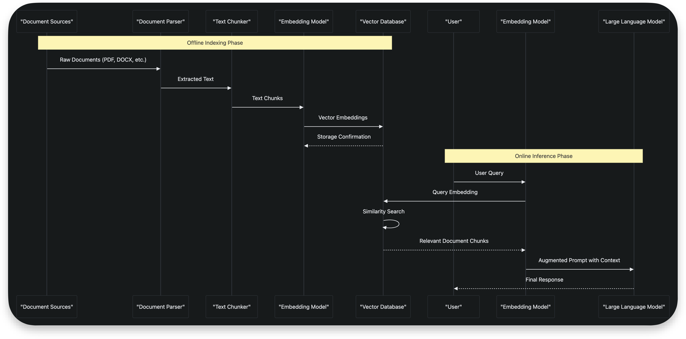

# RAG Components

## Introduction

Retrieval-Augmented Generation (RAG) is a powerful architectural pattern that enhances the accuracy and reliability of Large Language Models (LLMs) by integrating external knowledge sources during inference. This document provides a comprehensive overview of RAG components available in the Go ecosystem, focusing on Document Parsers, Pipeline and Data Versioning tools, Embedding libraries, and Vector Databases. The repository analyzed is a curated list of AI-related tools and libraries for Go, serving as a valuable resource for developers building AI applications with Golang. While the repository itself does not contain implementation code, it catalogs prominent tools and frameworks that can be used to construct complete RAG systems.

## RAG Architecture Overview

Retrieval-Augmented Generation (RAG) architecture combines the generative capabilities of Large Language Models with external knowledge retrieval to produce more accurate and contextually relevant responses. The RAG process follows a two-phase approach: an offline indexing phase and an online retrieval-generation phase. In the indexing phase, documents are parsed, chunked into smaller segments, converted to vector embeddings using embedding models, and stored in a vector database with appropriate metadata. During inference, a user query is similarly converted to an embedding, used to retrieve the most relevant document chunks from the vector database, and then combined with the original query as context for the LLM to generate a response. This architecture significantly improves LLM accuracy by grounding responses in verifiable external knowledge, reduces hallucinations, and enables models to answer questions about domain-specific or up-to-date information not present in their training data.

## Document Parsers

Document parsers are responsible for extracting text content from various file formats and converting them into a structured format suitable for downstream processing in RAG pipelines. These tools handle the complexities of different document structures, formatting, and encoding to ensure high-fidelity text extraction. In the Go ecosystem, while there are limited native document parsing libraries specifically for RAG, several powerful tools can be integrated into Go applications. The repository lists several document parsing tools, though many are implemented in other languages like Python. For Go applications, developers can either use these tools via subprocess calls or look for Go-native alternatives that provide similar functionality.

### Prominent Document Parsing Tools

- **[markitdown](https://github.com/microsoft/markitdown)**: A Python tool for converting various file and office documents to Markdown format, preserving structural elements and formatting.
- **[MinerU](https://github.com/opendatalab/MinerU)**: A high-quality tool for converting PDF documents to Markdown and JSON formats, maintaining document structure and metadata.
- **[docling](https://github.com/docling-project/docling)**: A document processing tool designed to prepare documents for generative AI applications, handling various document types and formats.
- **[marker](https://github.com/datalab-to/marker)**: A fast and accurate tool for converting PDF files to Markdown and JSON with high precision in text extraction and layout preservation.

These document parsers play a crucial role in the initial stage of RAG pipelines by transforming unstructured or semi-structured documents into clean, structured text that can be effectively processed and indexed. The choice of parser depends on the specific document types being processed and the required output format for downstream components.

### Pipeline and Data Versioning Tools

Pipeline and data versioning tools provide the infrastructure for managing the data flow and version control in RAG systems, ensuring reproducibility, traceability, and reliability of the knowledge retrieval process. These tools are essential for production-grade RAG applications where data evolves over time and maintaining historical versions is critical for auditing and debugging. They enable systematic processing of documents through various stages of the RAG pipeline while tracking changes and dependencies.

### [Pachyderm](https://github.com/pachyderm/pachyderm)

Pachyderm is a prominent data-centric pipeline and data versioning tool listed in the repository. It provides a comprehensive platform for building data pipelines with built-in version control, enabling developers to track changes to datasets and processing logic over time. Pachyderm's data versioning capabilities are particularly valuable for RAG systems, as they allow organizations to maintain historical versions of their knowledge bases, track when specific information was added or modified, and reproduce results from specific points in time. This is crucial for compliance, auditing, and debugging scenarios where understanding the context of retrieved information is essential.

Pachyderm integrates well with various data processing frameworks and can be used to orchestrate the entire RAG pipeline, from document ingestion and parsing to chunking, embedding generation, and storage in vector databases. Its container-based architecture allows for easy integration of different processing components, including those written in Go, making it a flexible choice for building robust RAG systems.

## Embedding Libraries and Benchmarks

Embedding libraries and benchmarks are critical components in RAG systems, responsible for converting text into numerical vector representations that capture semantic meaning. These embeddings enable similarity search in vector databases, allowing the system to find relevant document chunks based on semantic similarity rather than exact keyword matching. While the repository doesn't list specific Go libraries for generating embeddings, it includes important benchmarks that help evaluate and compare embedding models.

### [MTEB (Massive Text Embedding Benchmark)](https://github.com/embeddings-benchmark/mteb)

MTEB is an open-source benchmarking framework for evaluating and comparing text embedding models across eight tasks, including classification, retrieval, and clustering, using 58 datasets in 112 languages. It provides standardized performance metrics that help developers select the most appropriate embedding models for their specific use cases. When implementing RAG systems in Go, developers can use MTEB to evaluate different embedding models and choose those that perform best on tasks relevant to their application domain.

### [BRIGHT Benchmark](https://github.com/xlang-ai/BRIGHT)

BRIGHT is a challenging benchmark for reasoning-intensive retrieval, featuring 12 diverse datasets across domains like mathematics, code, and biology. It evaluates retrieval models on complex, context-rich queries that require logical inference, making it particularly relevant for RAG systems that need to handle sophisticated user queries. By using BRIGHT to evaluate embedding models, developers can ensure their RAG systems are capable of retrieving relevant information for complex, multi-step reasoning tasks.

For Go implementations, developers typically integrate with embedding models through APIs (such as OpenAI, Google Generative AI, or local models via Ollama) rather than implementing embedding generation directly in Go. The repository lists several tools that facilitate this integration, including SDKs for various LLM providers.

## Vector Databases

Vector databases are specialized storage systems designed to efficiently store and retrieve high-dimensional vector embeddings, serving as the retrieval component in RAG architectures. They enable fast approximate nearest neighbor (ANN) search, which is essential for finding semantically similar document chunks in large knowledge bases. The repository lists several prominent vector databases that can be integrated with Go applications to build scalable RAG systems.

### [Milvus](https://github.com/milvus-io/milvus)

Milvus is a high-performance, cloud-native vector database built specifically for scalable vector ANN search. It is optimized for handling large-scale vector data and provides advanced indexing algorithms to ensure fast retrieval even with billions of vectors. Milvus supports various distance metrics and indexing methods, allowing developers to tune performance based on their specific requirements. Its cloud-native architecture makes it suitable for distributed deployments, and it provides APIs that can be easily integrated with Go applications through available SDKs or HTTP interfaces.

### [Weaviate](https://github.com/weaviate/weaviate)

Weaviate is an open-source vector database that stores both objects and vectors, enabling the combination of vector search with structured filtering. This hybrid approach allows for more sophisticated queries that can filter results based on metadata while still leveraging semantic similarity search. Weaviate's fault tolerance and scalability make it suitable for production RAG applications, and its GraphQL-based API provides a flexible interface for querying data. The ability to combine vector search with structured queries is particularly valuable in RAG systems where retrieval needs to consider both semantic relevance and metadata constraints (such as document source, date, or access permissions).

### [TiDB](https://github.com/pingcap/tidb)

While primarily a distributed SQL database, TiDB is included in the vector database category of the repository, suggesting its potential use in hybrid retrieval scenarios. TiDB's distributed architecture and SQL capabilities make it suitable for storing structured metadata associated with vector embeddings, potentially serving as a complementary database to specialized vector databases in complex RAG architectures.

These vector databases provide the foundation for the retrieval component of RAG systems, enabling efficient search through large knowledge bases to find the most relevant information for augmenting LLM prompts.

## Integration Patterns and Frameworks

Several frameworks and tools in the Go ecosystem facilitate the integration of RAG components, providing abstractions and utilities that simplify the development of retrieval-augmented applications. These frameworks help manage the complexity of coordinating multiple components in a RAG pipeline, from document processing to retrieval and generation.

### [Langchaingo](https://github.com/tmc/langchaingo)

Langchaingo is a Go implementation of the popular LangChain framework, providing tools and abstractions for building LLM-based applications in Go. It likely includes components for implementing RAG patterns, such as document loaders, text splitters, vector store integrations, and retrieval chains. By using Langchaingo, Go developers can leverage familiar patterns from the LangChain ecosystem while building applications in their preferred language.

### [Genkit](https://github.com/genkit/genkit)

Genkit is an open-source framework for building AI-powered applications with code-centric patterns. It emphasizes observability and evaluations, making it easier to develop, integrate, and test AI features. Genkit works with various models and platforms, providing flexibility in choosing the underlying LLM and embedding providers. Its focus on developer experience and testing makes it suitable for building production-grade RAG applications.

### [Eino](https://github.com/enio/enio)

Eino is described as the ultimate LLM/AI application development framework in Golang, suggesting comprehensive support for building complex AI applications, including those with RAG architectures. As a full-featured framework, it likely provides integrated support for the various components needed in RAG systems.

### [Gollm](https://github.com/gollm/gollm)

Gollm provides a unified Go interface for multiple LLM providers, simplifying the integration of different models into RAG systems. This abstraction layer allows developers to switch between providers without changing their application code, providing flexibility in choosing the most appropriate LLM for their use case.

These frameworks significantly reduce the complexity of implementing RAG systems in Go by providing pre-built components, handling integration details, and offering abstractions that encapsulate common patterns.

## End-to-End RAG Implementation Example

This section outlines a conceptual end-to-end RAG implementation using Go and the tools referenced in the repository. While specific implementation details would depend on the chosen libraries and services, this example demonstrates the typical workflow and integration points.

The implementation would typically involve:

1. Using a document parser like MinerU or marker to extract text from various document formats
2. Processing the extracted text with a Go application that chunks the content into manageable segments
3. Using an embedding service (via API or local model) to convert text chunks into vector embeddings
4. Storing the embeddings and associated metadata in a vector database like Milvus or Weaviate
5. For inference, converting user queries to embeddings and retrieving relevant chunks
6. Augmenting the LLM prompt with retrieved context and generating a response

The repository's listed tools like langchaingo or genkit could provide higher-level abstractions to simplify this implementation.

## Performance Optimization Techniques

Building high-performance RAG systems requires careful consideration of various optimization techniques to ensure low latency and high throughput. These techniques span multiple components of the RAG architecture and are crucial for production deployments.

### Indexing and Retrieval Optimization

- Chunking Strategies: Optimizing chunk size and overlap to balance context preservation with retrieval precision
- Hybrid Search: Combining vector search with keyword-based or metadata filtering to improve retrieval accuracy
- Indexing Algorithms: Selecting appropriate ANN algorithms (like HNSW, IVF) based on data size and query patterns
- Caching: Implementing caching layers for frequent queries or retrieved results to reduce database load

### System Architecture Optimization

- Asynchronous Processing: Using message queues and worker pools to handle document ingestion and indexing asynchronously
- Load Balancing: Distributing queries across multiple vector database instances or embedding models
- Connection Pooling: Managing database connections efficiently to handle high concurrency
- Batch Processing: Processing multiple documents or queries in batches to improve throughput

### Resource Management

- Memory Optimization: Using efficient data structures and garbage collection tuning for Go applications
- Model Quantization: Using quantized embedding models to reduce memory footprint and improve inference speed
- Distributed Deployment: Scaling components horizontally across multiple servers or containers

These optimization techniques, combined with the robust tools and frameworks available for Go, enable the development of high-performance RAG systems capable of handling large knowledge bases and high query volumes.
