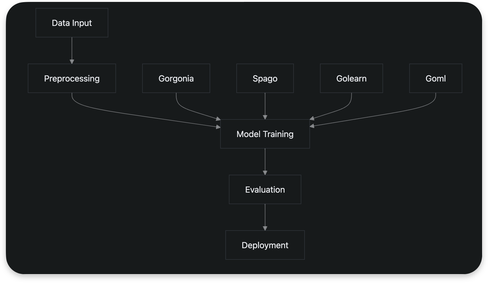
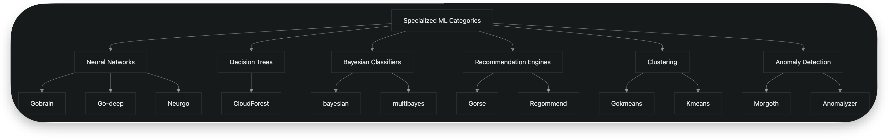
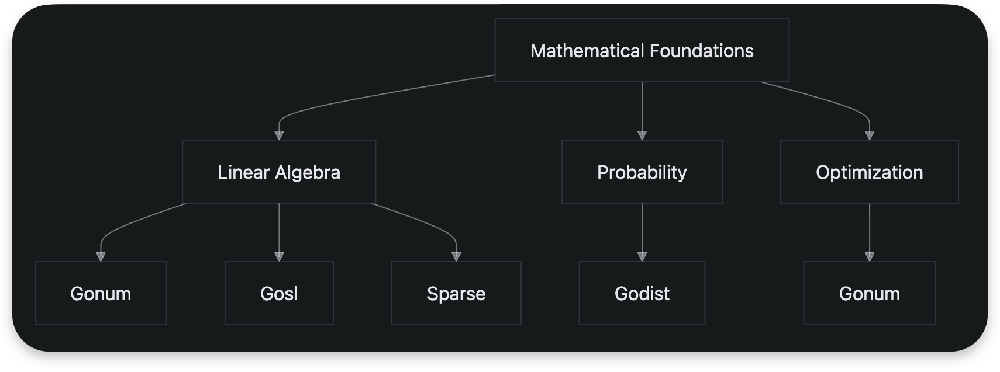
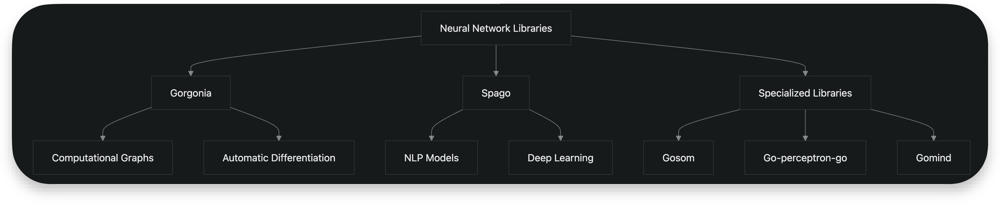
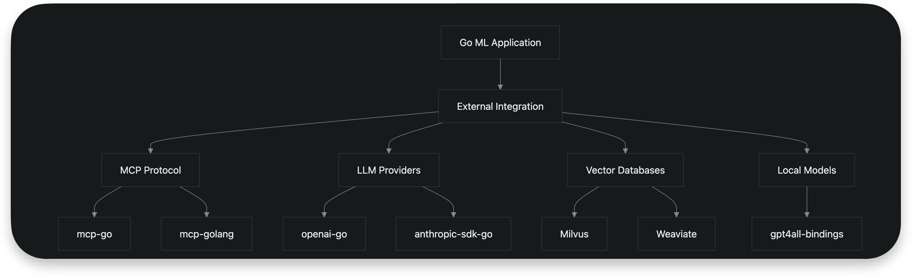
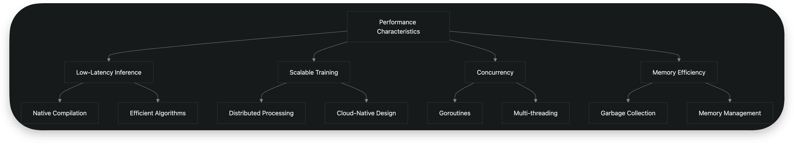

# Machine Learning Libraries

## Introduction

The Go programming language offers a growing ecosystem of machine learning libraries that leverage its strengths in concurrency, performance, and system-level programming. The "awesome-golang-ai" repository curates a comprehensive collection of tools and frameworks that enable developers to implement machine learning workflows entirely in Go. This document provides a detailed analysis of the key libraries available for numerical computing, model training, statistical analysis, and AI development in Go, focusing on their roles in modern ML workflows, implementation capabilities, and performance characteristics.

## General Machine Learning Frameworks

The Go ecosystem features several comprehensive machine learning frameworks that provide high-level abstractions for building and training models. These frameworks serve as the foundation for various AI development workflows, offering tools for data preprocessing, model training, and evaluation.

**[Gorgonia](https://github.com/gorgonia/gorgonia)** is a prominent library that facilitates machine learning in Go by providing computational graph capabilities similar to TensorFlow. It enables automatic differentiation and gradient computation, essential for training neural networks and other differentiable models. Gorgonia's design focuses on performance and flexibility, making it suitable for both research and production environments.

**[Spago](https://github.com/nlpodyssey/spago)** stands out as a self-contained machine learning and natural language processing library written entirely in Go. It provides implementations of various ML algorithms and deep learning components without external dependencies, promoting ease of deployment and reproducibility. Spago's architecture supports both supervised and unsupervised learning tasks, with particular emphasis on NLP applications.

**[Golearn](https://github.com/sjwhitworth/golearn)** offers a simple and customizable ML library with "batteries included" philosophy, providing ready-to-use implementations of common algorithms. It follows a design pattern similar to Python's scikit-learn, making it accessible to developers familiar with that ecosystem. Golearn supports various classification, regression, and clustering algorithms with consistent APIs.

**[Goml](https://github.com/cdipaolo/goml)** specializes in online machine learning, enabling models to learn from data streams incrementally without requiring batch processing. This capability is particularly valuable for applications with continuous data ingestion and real-time learning requirements.

## Specialized Machine Learning Categories

Beyond general frameworks, the Go ecosystem includes specialized libraries targeting specific ML domains and algorithmic approaches.

### Neural Networks

The repository lists multiple neural network implementations, each with different design philosophies and use cases:

- **[Gobrain](https://github.com/goml/gobrain)**: A straightforward neural network implementation suitable for educational purposes and simple applications
- **[Go-deep](https://github.com/patrikeh/go-deep)**: An artificial neural network library with support for various activation functions and training algorithms
- **[Neurgo](https://github.com/Neurgo/Neurgo)**: A neural network toolkit providing modular components for building custom architectures
- **[Gonn](https://github.com/gonn/gonn)**: Implements multiple neural network types including backpropagation (BPNN), radial basis function (RBF), and perceptron networks

### Decision Trees and Ensembles

**[CloudForest](https://github.com/ryanbressler/CloudForest)** is highlighted as a fast and flexible library for multi-threaded decision tree ensembles. It supports Random Forest and Gradient Boosting algorithms, specifically designed for high-dimensional heterogeneous data with missing values. CloudForest emphasizes speed and robustness, making it suitable for real-world machine learning tasks with complex data characteristics.

### Bayesian Classifiers

The ecosystem includes bayesian for Naive Bayesian classification and multibayes for multiclass Naive Bayesian classification. These libraries provide probabilistic approaches to classification tasks, particularly effective for text classification and other high-dimensional categorical problems.

### Recommendation Engines

Several recommendation system implementations are available:

- **[Gorse](https://github.com/zhubowen/gorse)**: A comprehensive recommender system engine with support for collaborative filtering and content-based approaches
- **[Regommend](https://github.com/zhubowen/regommend)**: A recommendation engine designed for integration into Go applications
- **[Too](https://github.com/zhubowen/too)**: A simple recommendation engine built on top of Redis for fast in-memory operations

### Clustering Algorithms

For unsupervised learning tasks, Go offers multiple k-means implementations:

- **[Gokmeans](https://github.com/zhubowen/gokmeans)**: A k-means algorithm implementation with focus on performance
- **[Kmeans](https://github.com/zhubowen/kmeans)**: Another k-means clustering implementation with straightforward API

## Numerical Computing and Mathematical Foundations

Robust numerical computing capabilities form the mathematical foundation for machine learning implementations in Go.

**[Gonum](https://github.com/gonum/gonum)** is a fundamental library that provides a comprehensive set of numeric tools for the Go programming language. It includes packages for:

- Matrix operations and linear algebra
- Statistical analysis and probability distributions
- Mathematical optimization
- Differential equations

Gonum serves as the backbone for many higher-level ML libraries, providing efficient implementations of core mathematical operations. Its matrix package supports various operations essential for machine learning, including matrix multiplication, decomposition, and eigenvalue computation.

For specialized linear algebra operations, Gosl offers extensive capabilities including eigenvalues, FFT, Bessel functions, and sparse matrix operations. The sparse library specifically addresses sparse matrix formats, which are crucial for handling high-dimensional data efficiently in scientific and machine learning applications.

For probability distributions, Godist provides implementations of various probability distributions and associated statistical methods, enabling probabilistic modeling and Bayesian inference workflows.

## Neural Networks and Deep Learning

The Go ecosystem provides several options for neural network and deep learning applications, ranging from educational implementations to production-ready frameworks.

**[Gorgonia](https://github.com/gorgonia/gorgonia)** emerges as the most sophisticated option for deep learning in Go, offering computational graph construction and automatic differentiation. While the repository doesn't provide implementation details, Gorgonia's description suggests it supports the core operations required for deep learning: tensor operations, gradient computation, and backpropagation.

**[Spago](https://github.com/nlpodyssey/spago)** positions itself as a self-contained deep learning framework with natural language processing capabilities. As a comprehensive library, it likely includes implementations of common neural network architectures such as feedforward networks, recurrent neural networks, and potentially transformer models.

Specialized neural network libraries offer more focused functionality:

- **[Gosom](https://github.com/milosgajdos/gosom)**: Implements self-organizing maps for unsupervised learning and dimensionality reduction
- **[Go-perceptron-go](https://github.com/made2591/go-perceptron-go)**: Supports single, multi-layer, and recurrent neural networks
- **[Gomind](https://github.com/surenderthakran/gomind)**: Provides a simplistic neural network library suitable for learning and prototyping

For data manipulation and preprocessing, several DataFrame implementations are available:

- **[Gota](https://github.com/go-gota/gota  )**: Provides DataFrame functionality for data wrangling and analysis
- **[Dataframe-go](https://github.com/rocketlaunchr/dataframe-go)**: Offers data frame capabilities for statistics and machine learning
- **[Qframe](https://github.com/tobgu/qframe)**: Implements immutable data frames for reliable data manipulation

## Model Definition and Training Workflows

The Go ML ecosystem supports various model definition and training paradigms, though specific implementation details for tensor operations and gradient computation are not provided in the repository.

Based on the libraries described, model definition in Go typically follows one of several patterns:

1. Imperative programming: Direct implementation of algorithms using Go's native syntax and control structures
2. Computational graphs: Declarative definition of operations using frameworks like Gorgonia
3. High-level APIs: Using pre-built components and estimators as in Golearn

For gradient computation, Gorgonia likely implements reverse-mode automatic differentiation, enabling efficient computation of gradients for neural network training. This capability is essential for implementing backpropagation in deep learning models.

Model training workflows in Go leverage the language's concurrency features to potentially parallelize operations across multiple cores. Libraries like CloudForest explicitly mention multi-threading support for decision tree ensembles, suggesting that performance optimization through parallel execution is a design consideration in the ecosystem.

The regression library provides multivariable regression capabilities, while ridge implements ridge regression, offering regularized linear models for scenarios with multicollinearity or overfitting concerns.

## Integration with External Systems

The repository highlights several libraries that facilitate integration between Go ML applications and external systems.

**MCP (Model Context Protocol)** implementations like **mcp-go** and **mcp-golang** enable seamless integration between LLM applications and external data sources and tools. These libraries allow Go applications to interact with external systems through standardized protocols, enhancing interoperability.

**[Gollm](https://github.com/zhubowen/gollm)** provides a unified interface for language model providers, simplifying integration with various LLM platforms. This abstraction layer allows developers to switch between different providers without changing their core application logic.

For vector storage and similarity search, the ecosystem integrates with external databases:

- **[Milvus](https://github.com/milvus-io/milvus)**: A high-performance, cloud-native vector database for scalable approximate nearest neighbor search
- **[Weaviate](https://github.com/Weaviate/weaviate)**: An open-source vector database that combines vector search with structured filtering
- **[TiDB](https://github.com/pingcap/tidb)**: A distributed SQL database that can be used for structured data storage alongside ML workflows

The **[gpt4all-bindings](https://github.com/gpt4all/gpt4all-bindings)** provide interfaces to local LLMs, enabling integration with GPT4All models for offline inference scenarios.

While the repository doesn't explicitly mention ONNX or other standard model format support, the presence of API wrappers for major LLM providers (**[openai-go](https://github.com/sashabaranov/openai-go)**, **[anthropic-sdk-go](https://github.com/anthropic/anthropic-sdk-go)**, **[deepseek-go](https://github.com/cohesion-org/deepseek-go)**) indicates strong integration capabilities with external AI services.

## Performance Characteristics

Go's design principles translate into favorable performance characteristics for machine learning applications, particularly in production environments requiring low-latency inference and scalable training pipelines.

The repository explicitly highlights Go's "inexplicable speed, easy debugging, concurrency" as advantages for AI applications. Several libraries emphasize performance-oriented design:

- **[CloudForest](https://github.com/zhubowen/cloudforest)** is described as "fast" and "flexible" with multi-threaded support for decision tree ensembles
- **[Milvus](https://github.com/milvus-io/milvus)** is characterized as "high-performance" and "cloud-native" for scalable vector search
- **[Gota](https://github.com/go-gota/gota)** and other data manipulation libraries are designed for efficient data wrangling in ML workflows

Go's native concurrency model enables parallel execution of ML operations across multiple CPU cores, which can significantly accelerate training and inference tasks. The language's efficient memory management and compilation to native code contribute to low-latency inference capabilities, making Go suitable for real-time ML applications.

For scalable training pipelines, Go's strong support for distributed systems and microservices architecture allows ML workflows to be distributed across multiple nodes. The availability of cloud-native vector databases like Milvus further enhances scalability for similarity search operations in large-scale ML systems.

The ecosystem also includes specialized libraries for performance-critical applications:

- **[Anomalyzer](https://github.com/lytics/anomalyzer)** provides probabilistic anomaly detection for time series data
- **[Morgoth](https://github.com/nathanielc/morgoth)** focuses on metric anomaly detection
- **[Goanomaly](https://github.com/sec51/goanomaly)** implements Gaussian distribution-based anomaly detection

These libraries suggest that the Go ML ecosystem is well-suited for monitoring and real-time analytics applications requiring low-latency processing.

## Conclusion

The Go machine learning ecosystem offers a diverse collection of libraries that cater to various AI development needs, from general-purpose frameworks to specialized algorithms. Key strengths include performance, concurrency support, and seamless integration capabilities with external systems.

Gorgonia and Spago emerge as the most comprehensive frameworks for deep learning and general ML tasks, while Gonum provides the essential mathematical foundation for numerical computing. The ecosystem demonstrates particular strength in production-oriented applications requiring low-latency inference and scalable architectures.

For developers considering Go for ML applications, the ecosystem is well-suited for:

- High-performance inference servers
- Real-time analytics and monitoring systems
- Distributed ML pipelines
- Applications requiring tight integration with system-level components

While the ecosystem may not yet match the breadth of Python's ML libraries, Go's performance characteristics and robust concurrency model make it an excellent choice for production ML systems where efficiency and reliability are paramount.
